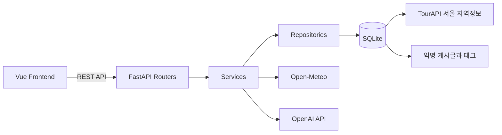

# LocalHub Backend

서울 지역정보, 익명 커뮤니티, 현재 날씨, 여행 적합도와 AI 챗봇 API를 제공하는 **LocalHub 백엔드**입니다.

FastAPI, SQLAlchemy, SQLite로 구성되며, 한국관광공사 TourAPI 4.0의 서울 지역 데이터를 검색 가능한 형태로 적재합니다.

---

## 📌 프로젝트 소개

LocalHub 백엔드는 다음 기능을 담당합니다.

- 서울 지역정보 JSON을 SQLite에 적재
- 카테고리·검색어·자치구 기반 지역정보 조회
- 지도 마커용 좌표 데이터 제공
- 익명 커뮤니티 게시글 CRUD
- 게시글 태그, 검색, 정렬, 페이지네이션, 조회수 관리
- Open-Meteo 기반 서울 현재 날씨 조회
- 고정 규칙 기반 여행 적합도 계산
- OpenAI API와 SQLite 검색을 결합한 경량 RAG 챗봇
- Vue 프론트엔드에 REST API 제공

---

## ✨ 주요 기능

### 1. 서울 지역정보

지원 카테고리:

- 관광지
- 문화시설
- 축제공연행사
- 여행코스
- 레포츠
- 숙박
- 쇼핑
- 음식점

지원 기능:

- 목록 조회
- 상세 조회
- 장소명·주소 검색
- 카테고리 필터
- 서울 시군구 코드 필터
- 페이지네이션
- 지도 마커용 좌표 조회
- 대표 이미지·썸네일·주소·전화번호 제공

### 2. 익명 커뮤니티

- 회원가입·로그인 없음
- 게시글 작성·조회·수정·삭제
- 작성 시 수정·삭제용 비밀번호 등록
- 비밀번호 일치 여부 확인 후 수정·삭제
- 카테고리, 제목, 내용, 태그 저장
- 제목·본문·태그 통합 검색
- 태그 필터
- 최신순·조회수순 정렬
- 상세 조회 시 조회수 1 증가
- 태그 최대 5개, 태그당 최대 15자

> 현재 비밀번호는 교육용 의뢰사항에 따라 단순 일치 비교 방식으로 구현되어 있습니다. 실제 운영 서비스에서는 반드시 비밀번호 해시를 적용해야 합니다.

### 3. 현재 날씨와 여행 적합도

- Open-Meteo 현재 날씨 API 사용
- 서울 중심 좌표 기준 조회
- 기온
- 체감온도
- 습도
- 강수량
- 풍속
- WMO 날씨 코드 한글 변환
- 여행 적합도 0~100점 계산
- `매우 좋음`, `좋음`, `보통`, `주의`, `나쁨` 등급
- 현재 조건에 따른 관광 추천 문구
- 타임아웃·외부 API 오류·응답 형식 오류 처리

Open-Meteo는 현재 구현에서 API Key가 필요하지 않습니다.

### 4. AI 챗봇

`POST /api/chat`에서 다음 단계를 수행합니다.

```text
사용자 질문과 이전 대화
        ↓
OpenAI Structured Outputs 기반 질문 분석
        ↓
SQLite 지역정보·게시글 읽기 전용 검색
        ↓
필요한 경우 WeatherService 호출
        ↓
검색 결과를 근거로 OpenAI 최종 답변 생성
        ↓
answer + references 반환
```

지원 질문 유형:

- 일반 지역정보 검색
- 축제·공연·행사 검색
- 모범음식점 검색
- 커뮤니티 게시글 검색
- 서울 현재 날씨
- 서비스 사용 안내
- 지원 범위 밖 질문 안내

챗봇은 전체 JSON을 OpenAI에 전달하지 않습니다. 먼저 SQLite에서 관련 데이터만 검색한 뒤 필요한 근거만 전달합니다.

---

## 🛠️ 기술 스택

| 구분 | 기술 |
|---|---|
| Language | Python |
| Framework | FastAPI |
| ASGI Server | Uvicorn |
| ORM | SQLAlchemy 2 |
| Database | SQLite |
| Validation | Pydantic 2 |
| Settings | pydantic-settings |
| AI | OpenAI Responses API |
| HTTP Client | HTTPX |
| Weather | Open-Meteo |
| Deployment | Render |
| IDE | Visual Studio Code |

---

## 🏗️ 시스템 구조



---

## 📁 프로젝트 구조

```text
LocalHub-Backend/
├─ app/
│  ├─ core/
│  │  └─ config.py                   # 환경변수와 공통 설정
│  ├─ db/
│  │  ├─ database.py                 # 엔진, 세션, 테이블 생성
│  │  └─ models/
│  │     ├─ location.py              # 서울 지역정보
│  │     ├─ post.py                  # 게시글
│  │     └─ post_tag.py              # 게시글 태그
│  ├─ repositories/
│  │  ├─ location_repository.py
│  │  ├─ post_repository.py
│  │  └─ chat_search_repository.py   # 챗봇 전용 읽기 검색
│  ├─ routers/
│  │  ├─ health.py
│  │  ├─ locations.py
│  │  ├─ posts.py
│  │  ├─ weather.py
│  │  └─ chat.py
│  ├─ schemas/
│  │  ├─ location.py
│  │  ├─ post.py
│  │  ├─ weather.py
│  │  ├─ chat.py
│  │  └─ chat_intent.py
│  ├─ services/
│  │  ├─ location_service.py
│  │  ├─ post_service.py
│  │  ├─ weather_service.py
│  │  └─ chat_service.py
│  ├─ __init__.py
│  └─ main.py
├─ data/
│  ├─ raw/                           # 한국관광공사 원본 JSON
│  └─ localhub.db                    # 로컬 SQLite DB
├─ scripts/
│  ├─ create_tables.py
│  ├─ import_locations.py
│  └─ generate_mock_data.py
├─ tests/
│  ├─ CHAT_TEST_GUIDE.md
│  ├─ test_chat_schema_unit.py
│  ├─ test_chat_repository_unit.py
│  ├─ test_chat_service_unit.py
│  ├─ test_chat_intent_live.py
│  ├─ test_chat_rag_live.py
│  ├─ test_chat_api_live.py
│  ├─ test_chat_data_precheck.py
│  ├─ test_openai.py
│  └─ test_post_repository.py
├─ .env.example
├─ .gitignore
├─ requirements.txt
└─ README.md
```

---

## ✅ 사전 요구사항

```text
Python 3.11 이상 권장
Git
```

확인:

```sh
python --version
git --version
```

Windows에서 `python` 명령이 동작하지 않으면:

```powershell
py --version
```

---

## 🚀 로컬 실행

### 1. 저장소 Clone

```sh
git clone <LocalHub-Backend 저장소 URL>
cd LocalHub-Backend
```

### 2. 가상환경 생성

Windows PowerShell:

```powershell
py -m venv .venv
.\.venv\Scripts\Activate.ps1
```

PowerShell 실행 정책 오류가 발생한 경우 현재 터미널에만 허용합니다.

```powershell
Set-ExecutionPolicy -Scope Process -ExecutionPolicy Bypass
.\.venv\Scripts\Activate.ps1
```

macOS 또는 Linux:

```sh
python3 -m venv .venv
source .venv/bin/activate
```

### 3. 패키지 설치

```sh
python -m pip install --upgrade pip
pip install -r requirements.txt
```

### 4. 환경변수 설정

`.env.example`을 복사합니다.

Windows PowerShell:

```powershell
Copy-Item .env.example .env
```

macOS 또는 Linux:

```sh
cp .env.example .env
```

권장 `.env` 예시:

```env
APP_NAME=LocalHub API
APP_VERSION=0.1.0
ENVIRONMENT=development
DEBUG=true

API_PREFIX=/api
DATABASE_URL=sqlite:///./data/localhub.db

CORS_ORIGINS=["http://localhost:5173","http://127.0.0.1:5173"]

OPENAI_API_KEY=실제_OpenAI_API_Key
OPENAI_MODEL=gpt-5-mini

WEATHER_API_BASE_URL=https://api.open-meteo.com/v1/forecast

TARGET_REGION=서울
DEFAULT_MAP_LIMIT=300
MAX_MAP_LIMIT=500
DEFAULT_PAGE_SIZE=20
MAX_PAGE_SIZE=100
```

### 환경변수 설명

| 환경변수 | 설명 | 필수 |
|---|---|---:|
| `APP_NAME` | FastAPI 서비스 이름 | 선택 |
| `APP_VERSION` | API 버전 | 선택 |
| `ENVIRONMENT` | 실행 환경 | 선택 |
| `DEBUG` | 디버그 모드 | 선택 |
| `API_PREFIX` | 공통 API 경로 | 선택 |
| `DATABASE_URL` | SQLite 연결 주소 | 필수 |
| `CORS_ORIGINS` | 허용할 프론트엔드 Origin의 JSON 배열 | 필수 |
| `OPENAI_API_KEY` | 챗봇 OpenAI 호출 키 | 챗봇 사용 시 필수 |
| `OPENAI_MODEL` | OpenAI 모델명 | 챗봇 사용 시 필수 |
| `WEATHER_API_BASE_URL` | Open-Meteo API 주소 | 날씨 사용 시 필수 |
| `TARGET_REGION` | 서비스 대상 지역 | 선택 |
| `DEFAULT_MAP_LIMIT` | 기본 지도 마커 수 | 선택 |
| `MAX_MAP_LIMIT` | 최대 지도 마커 수 | 선택 |
| `DEFAULT_PAGE_SIZE` | 기본 페이지 크기 | 선택 |
| `MAX_PAGE_SIZE` | 최대 페이지 크기 | 선택 |

> 현재 Open-Meteo는 API Key가 필요하지 않으므로 `WEATHER_API_KEY`는 비워둘 수 있습니다.

---

## 🗄️ 데이터베이스 초기화와 지역정보 적재

### 1. 테이블 생성

FastAPI 서버 시작 시 테이블을 자동 생성합니다.

수동으로 생성하려면:

```sh
python scripts/create_tables.py
```

### 2. 원본 JSON 배치

```text
data/raw/
├─ 서울_관광지.json
├─ 서울_문화시설.json
├─ 서울_축제공연행사.json
├─ 서울_여행코스.json
├─ 서울_레포츠.json
├─ 서울_숙박.json
├─ 서울_쇼핑.json
└─ 서울_음식점.json
```

### 3. 지역정보 적재

기존 데이터는 유지하고 신규 등록·갱신:

```sh
python scripts/import_locations.py
```

기존 `locations` 데이터를 삭제하고 다시 적재:

```sh
python scripts/import_locations.py --reset
```

다른 원본 폴더 사용:

```sh
python scripts/import_locations.py --data-dir 경로
```

적재 스크립트 처리 규칙:

- `contentid` → `content_id`
- `contenttypeid` → `content_type_id`
- `mapx` → `longitude`
- `mapy` → `latitude`
- `firstimage` → `first_image`
- `firstimage2` → `thumbnail_image`
- 빈 문자열 → `None`
- 동일 `content_id`가 있으면 기존 행 갱신
- 필수값 누락 또는 파일 안 중복 ID는 건너뜀

---

## ▶️ 개발 서버 실행

```sh
python -m uvicorn app.main:app --reload
```

접속 주소:

```text
API:     http://localhost:8000
Swagger: http://localhost:8000/docs
ReDoc:   http://localhost:8000/redoc
Health:  http://localhost:8000/api/health
```

서버 종료:

```text
Ctrl + C
```

---

## 📡 API

### 시스템

| 기능 | Method | Endpoint |
|---|---|---|
| API 루트 | GET | `/` |
| 서버 상태 | GET | `/api/health` |

### 지역정보

| 기능 | Method | Endpoint | 주요 Query |
|---|---|---|---|
| 지역정보 목록 | GET | `/api/locations` | `category`, `keyword`, `sigungu_code`, `page`, `size` |
| 지도 마커 목록 | GET | `/api/locations/map` | `category`, `keyword`, `sigungu_code`, `limit` |
| 지역정보 상세 | GET | `/api/locations/{content_id}` | - |

### 날씨

| 기능 | Method | Endpoint |
|---|---|---|
| 서울 현재 날씨·여행 적합도 | GET | `/api/weather/current` |

### 커뮤니티

| 기능 | Method | Endpoint | 설명 |
|---|---|---|---|
| 게시글 목록 | GET | `/api/posts` | 카테고리·검색어·태그·정렬·페이지네이션 |
| 게시글 작성 | POST | `/api/posts` | 비밀번호와 태그 포함 |
| 게시글 상세 | GET | `/api/posts/{post_id}` | 조회수 1 증가 |
| 게시글 수정 | PUT | `/api/posts/{post_id}` | 비밀번호 일치 필요 |
| 게시글 삭제 | DELETE | `/api/posts/{post_id}` | JSON Body에 비밀번호 전달 |

게시글 목록 Query:

```text
category
keyword
tag
page
size
sort=latest|views
```

### 챗봇

| 기능 | Method | Endpoint |
|---|---|---|
| 지역정보·게시글·날씨 챗봇 | POST | `/api/chat` |

---

## 💬 챗봇 요청과 응답

요청:

```http
POST /api/chat
Content-Type: application/json
```

```json
{
  "message": "종로구에서 비 오는 날 가기 좋은 문화시설 세 곳 추천해줘",
  "history": [
    {
      "role": "user",
      "content": "오늘 서울 여행을 준비하고 있어"
    }
  ]
}
```

응답:

```json
{
  "answer": "비 오는 날 방문하기 좋은 종로구 문화시설을 안내해드릴게요.",
  "references": [
    {
      "type": "location",
      "id": "123456",
      "title": "서울의 문화시설",
      "category": "문화시설",
      "address": "서울특별시 종로구",
      "tel": "02-0000-0000",
      "latitude": 37.5704,
      "longitude": 126.9779,
      "image_url": "https://example.com/image.jpg",
      "snippet": null,
      "tags": [],
      "created_at": null
    }
  ]
}
```

게시글 참고자료는 `snippet`, `tags`, `created_at`을 포함할 수 있으며 게시글 수정용 비밀번호는 응답에 포함하지 않습니다.

---

## 🤖 경량 RAG 동작

### 질문 분석

OpenAI Structured Outputs를 사용해 질문을 다음 정보로 구조화합니다.

- 의도
- 카테고리
- 서울 자치구
- 검색 핵심어
- 요청 결과 개수
- 날짜 표현
- 이전 대화에서 이어지는 조건

### 검색

`ChatSearchRepository`가 다음 데이터를 읽기 전용으로 검색합니다.

- 지역정보
- 축제·공연·행사
- `모범` 표기가 실제 데이터에 있는 음식점
- 게시글 제목·본문·카테고리·태그
- 현재 날씨

### 답변 생성 원칙

- DB 검색 결과를 근거로 답변
- 실제 결과가 없으면 장소나 게시글을 임의 생성하지 않음
- 축제 시작일·종료일이 없으면 날짜를 단정하지 않음
- 일반 음식점을 임의로 모범음식점이라고 안내하지 않음
- 게시글 비밀번호를 컨텍스트나 응답에 포함하지 않음
- 최종 답변에 사용한 근거를 `references`로 반환

---

## 🌤️ 여행 적합도 계산

여행 적합도는 OpenAI가 생성하지 않고 백엔드 고정 규칙으로 계산합니다.

평가 요소:

- 기온
- 강수량
- 풍속
- 습도
- WMO 날씨 현상 코드

등급:

| 점수 | 등급 |
|---:|---|
| 85~100 | 매우 좋음 |
| 70~84 | 좋음 |
| 50~69 | 보통 |
| 30~49 | 주의 |
| 0~29 | 나쁨 |

---

## 🧪 테스트

### 코드 문법 확인

```sh
python -m compileall app tests
```

### OpenAI와 운영 DB를 사용하지 않는 챗봇 단위 테스트

```sh
python -m unittest discover -s tests -p "test_chat_*_unit.py" -v
```

### 실제 DB 사전 점검

```sh
python tests/test_chat_data_precheck.py
```

### OpenAI 연결 확인

```sh
python tests/test_openai.py
```

### 질문 유형 분류 테스트

```sh
python tests/test_chat_intent_live.py --case location
python tests/test_chat_intent_live.py --case festival
python tests/test_chat_intent_live.py --case model_restaurant
python tests/test_chat_intent_live.py --case post
python tests/test_chat_intent_live.py --case weather
```

### DB 검색과 OpenAI 최종 답변 테스트

```sh
python tests/test_chat_rag_live.py --case location
python tests/test_chat_rag_live.py --case festival
python tests/test_chat_rag_live.py --case post
python tests/test_chat_rag_live.py --case weather
```

### 실행 중인 FastAPI 엔드포인트 테스트

첫 번째 터미널:

```sh
python -m uvicorn app.main:app --reload
```

두 번째 터미널:

```sh
python tests/test_chat_api_live.py --case location
python tests/test_chat_api_live.py --case post
python tests/test_chat_api_live.py --case weather
```

### 게시글 Repository 테스트

현재 `test_post_repository.py`는 pytest를 사용합니다.

```sh
pip install pytest
pytest tests/test_post_repository.py
```

> 실제 OpenAI 테스트는 API 토큰을 사용하므로 필요한 케이스만 실행합니다.

---

## 🚢 Render 배포

### 기본 설정

| 설정 | 값 |
|---|---|
| Branch | `main` |
| Runtime | Python |
| Build Command | `pip install -r requirements.txt` |
| Start Command | `python -m uvicorn app.main:app --host 0.0.0.0 --port $PORT` |

### 환경변수 예시

```env
APP_NAME=LocalHub API
APP_VERSION=0.1.0
ENVIRONMENT=production
DEBUG=false

API_PREFIX=/api
DATABASE_URL=sqlite:///./data/localhub.db

CORS_ORIGINS=["https://실제-프론트엔드.netlify.app"]

OPENAI_API_KEY=실제_OpenAI_API_Key
OPENAI_MODEL=gpt-5-mini

WEATHER_API_BASE_URL=https://api.open-meteo.com/v1/forecast
TARGET_REGION=서울
```

### 배포 확인

- `/`
- `/api/health`
- `/docs`
- `/api/locations`
- `/api/locations/map`
- `/api/weather/current`
- 게시글 CRUD
- `/api/chat`
- Netlify 프론트에서 CORS 오류 없이 호출되는지 확인

---

## ⚠️ SQLite 배포 주의사항

SQLite는 파일 기반 데이터베이스입니다.

Render의 영구 디스크가 없는 환경에서는 재시작·재배포 시 실행 중 추가한 게시글과 DB 변경사항이 사라질 수 있습니다.

교육·발표용 배포 시:

- 배포 전 지역정보 적재 상태 확인
- 발표 직전 불필요한 재배포 지양
- SQLite 파일 또는 원본 JSON을 별도 보관
- DB가 사라진 경우 지역정보 재적재
- 게시글 영구 보존이 필요하면 Render Persistent Disk 또는 외부 DB 사용

---

## 🔐 보안 규칙

Git에 올리지 않는 항목:

```text
.env
.venv/
venv/
__pycache__/
*.db
*.sqlite
*.sqlite3
실제 API Key
```

커밋 전 확인:

```sh
git status
```

민감정보가 원격 저장소에 올라간 경우 파일만 삭제하지 말고 해당 키를 폐기하고 새 키를 발급합니다.

현재 교육용 게시글 비밀번호 방식은 실제 서비스 보안 요구사항을 충족하지 않으므로 운영 환경에 그대로 사용하지 않습니다.

---

## ⚠️ 데이터 제한

- `source_created_at`, `source_modified_at`은 TourAPI 원본 등록·수정 시각입니다.
- 위 두 값은 축제 개최 시작일·종료일이 아닙니다.
- 실제 행사 일정 필드가 없어 축제 캘린더 API를 제공하지 않습니다.
- 모범음식점 검색은 DB의 장소명·카테고리·분류·원본 파일명에 `모범` 표기가 확인된 경우에만 결과를 반환합니다.
- 이미지가 없는 지역정보는 `first_image`, `thumbnail_image`가 `null`일 수 있습니다.
- 지도 마커 API는 위도와 경도가 있는 데이터만 반환합니다.

---

## 🌿 협업 규칙

### 브랜치

```text
feature/기능명
fix/수정내용
docs/문서명
chore/설정내용
deploy/배포대상
```

### 커밋

```text
type(scope): 작업 내용
```

예시:

```text
feat(location): 서울 지역정보 목록과 지도 API 구현
feat(post): 익명 게시글 CRUD와 태그 검색 구현
feat(weather): Open-Meteo 날씨와 여행 적합도 추가
feat(chat): 질문 분석과 경량 RAG 검색 구현
fix(chat): 장소 참고 정보 이미지 URL 반환
docs(readme): 최종 구현 내용과 실행 방법 반영
deploy(render): Render 실행 설정 추가
```

자세한 규칙은 [CONTRIBUTING.md](./CONTRIBUTING.md)를 참고합니다.

---

## 📄 데이터 출처와 라이선스

본 서비스는 한국관광공사 TourAPI 4.0의 서울 지역정보를 활용합니다.

| 항목 | 내용 |
|---|---|
| 제공 기관 | 한국관광공사 |
| 데이터명 | 국문 관광정보 서비스 TourAPI 4.0 |
| 수집 지역 | 서울 |
| 전체 데이터 | 8,150건 |
| 라이선스 | 공공누리 제3유형 — 출처 표시, 변경 금지 |

카테고리별 원본 데이터:

| 파일 | 건수 |
|---|---:|
| 서울_관광지.json | 783 |
| 서울_문화시설.json | 566 |
| 서울_축제공연행사.json | 201 |
| 서울_여행코스.json | 51 |
| 서울_레포츠.json | 126 |
| 서울_숙박.json | 423 |
| 서울_쇼핑.json | 4,368 |
| **합계** | **6518** |

출처 표시:

```text
이 서비스는 한국관광공사 TourAPI 4.0의 관광정보를 활용하였습니다.
출처: 한국관광공사
라이선스: 공공누리 제3유형
```

- 공공데이터포털: https://www.data.go.kr/data/15101578/openapi.do
- 공공누리 제3유형: https://www.kogl.or.kr/info/licenseTypeView.do?licenseType=3
- LocalHub GitHub: https://github.com/LocalHub-S19